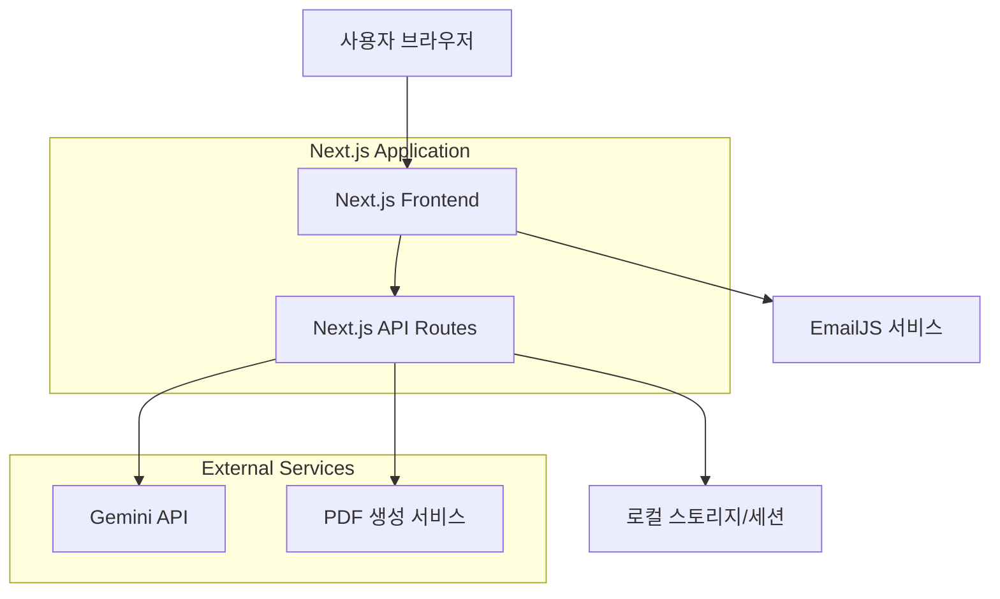

# Design Document

## Overview

AI 기반 개인화 학습지원 서비스는 Next.js 풀스택 아키텍처를 기반으로 구축되며, Gemini API를 활용하여 사용자 맞춤형 학습 조언을 제공합니다. 사용자는 직관적인 웹 인터페이스를 통해 학습 상황을 입력하고, AI가 생성한 개인화된 피드백을 실시간으로 받을 수 있습니다.

## Architecture

### System Architecture



### Technology Stack

- **Frontend**: Next.js 13+ (App Router), React, Tailwind CSS
- **Backend**: Next.js API Routes
- **AI Service**: Google Gemini API (@google/generative-ai)
- **Storage**: Browser LocalStorage (MVP), 추후 확장 시 Database
- **PDF Generation**: jsPDF 또는 Puppeteer
- **Email Service**: EmailJS (클라이언트 사이드 이메일 전송)
- **Deployment**: Vercel (권장)

## Components and Interfaces

### Frontend Components

#### 1. InputForm Component

```typescript
interface InputFormProps {
  onSubmit: (data: UserInput) => void;
  isLoading: boolean;
}

interface UserInput {
  learningGoal: string;
  interests: string[];
  currentConcerns: string;
  email?: string;
}
```

#### 2. ChatInterface Component

```typescript
interface ChatMessage {
  id: string;
  type: "user" | "ai";
  content: string;
  timestamp: Date;
}

interface ChatInterfaceProps {
  messages: ChatMessage[];
  isLoading: boolean;
}
```

#### 3. RecommendationCards Component

```typescript
interface Recommendation {
  id: string;
  title: string;
  description: string;
  category: "resource" | "activity" | "strategy";
  priority: "high" | "medium" | "low";
}

interface RecommendationCardsProps {
  recommendations: Recommendation[];
}
```

### API Interfaces

#### 1. Chat API Endpoint

```typescript
// POST /api/chat
interface ChatRequest {
  userInput: UserInput;
  conversationHistory?: ChatMessage[];
}

interface ChatResponse {
  success: boolean;
  message: ChatMessage;
  recommendations: Recommendation[];
  error?: string;
}
```

#### 2. Save Conversation API

```typescript
// POST /api/save-conversation
interface SaveRequest {
  conversationId: string;
  messages: ChatMessage[];
  recommendations: Recommendation[];
}
```

#### 3. PDF Export API Endpoint

```typescript
// POST /api/export-pdf
interface PDFExportRequest {
  conversationId: string;
  content: {
    messages: ChatMessage[];
    recommendations: Recommendation[];
    userInput: UserInput;
  };
}

interface PDFExportResponse {
  success: boolean;
  pdfUrl?: string;
  error?: string;
}
```

#### 4. EmailJS Integration (Client-side)

```typescript
interface EmailData {
  to_email: string;
  user_name: string;
  conversation_content: string;
  recommendations: string;
  date: string;
}
```

## Data Models

### User Input Model

```typescript
interface UserInput {
  learningGoal: string; // 학습 목표
  interests: string[]; // 관심 분야 (태그 형태)
  currentConcerns: string; // 현재 고민
  learningLevel?: string; // 학습 수준 (선택사항)
  timeAvailable?: string; // 가용 시간 (선택사항)
}
```

### Conversation Model

```typescript
interface Conversation {
  id: string;
  userId?: string;
  createdAt: Date;
  updatedAt: Date;
  messages: ChatMessage[];
  recommendations: Recommendation[];
  userInput: UserInput;
}
```

### Gemini API Integration Model

```typescript
interface GeminiPrompt {
  systemInstruction: string;
  userMessage: string;
  context: UserInput;
}

interface GeminiResponse {
  feedback: string;
  recommendations: Recommendation[];
  followUpQuestions?: string[];
}
```

## Error Handling

### Frontend Error Handling

- **Network Errors**: 연결 실패 시 재시도 버튼과 함께 사용자 친화적 메시지 표시
- **Validation Errors**: 실시간 폼 검증 및 인라인 에러 메시지
- **API Errors**: Toast 알림을 통한 에러 상태 전달

### Backend Error Handling

- **Gemini API Errors**: API 호출 실패 시 fallback 응답 제공
- **Rate Limiting**: API 호출 제한 시 적절한 대기 시간 안내
- **Input Validation**: 사용자 입력 검증 및 sanitization

### Error Response Format

```typescript
interface ErrorResponse {
  success: false;
  error: {
    code: string;
    message: string;
    details?: any;
  };
}
```

## Testing Strategy

### Unit Testing

- **Components**: React Testing Library를 사용한 컴포넌트 테스트
- **API Routes**: Jest를 사용한 API 엔드포인트 테스트
- **Utilities**: 유틸리티 함수 및 헬퍼 함수 테스트

### Integration Testing

- **API Integration**: Gemini API 연동 테스트 (Mock 사용)
- **End-to-End Flow**: 사용자 입력부터 AI 응답까지 전체 플로우 테스트

### Test Coverage Areas

1. 사용자 입력 폼 검증
2. Gemini API 호출 및 응답 처리
3. 채팅 인터페이스 렌더링
4. 추천 카드 생성 및 표시
5. 로컬 스토리지 저장/불러오기
6. PDF 생성 및 다운로드 기능

### Performance Testing

- **API Response Time**: Gemini API 응답 시간 모니터링
- **Frontend Rendering**: 대화 목록 렌더링 성능 측정
- **Memory Usage**: 장시간 사용 시 메모리 누수 확인

## Security Considerations

### API Key Management

- Gemini API 키는 환경 변수로 관리
- 클라이언트 사이드에서 API 키 노출 방지
- Next.js API Routes를 통한 서버 사이드 API 호출

### Input Sanitization

- 사용자 입력 데이터 검증 및 정화
- XSS 공격 방지를 위한 입력 필터링
- SQL Injection 방지 (향후 DB 연동 시)

### Data Privacy

- 사용자 개인정보 최소 수집
- 로컬 스토리지 사용으로 서버 데이터 저장 최소화
- PDF 생성 시 임시 데이터만 사용하고 서버에 저장하지 않음
